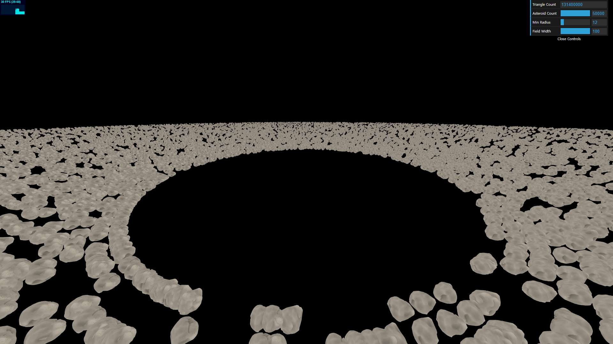

# WebGL2 Instanced Drawing & GPGPU Demo

Built with: JavaScript, WebGL2, [stats.js](https://github.com/mrdoob/stats.js/), [dat.GUI](https://github.com/dataarts/dat.gui), [loaders.gl (OBJLoader)](https://github.com/visgl/loaders.gl)

Instanced Drawing + GPGPU simulation using fragment shaders (no compute shader): This application consists of two rendering passes. The first GPGPU pass writes relevant information for rendering asteroids (such as position, rotation axis, and rotation angle) to a float texture (RGBA32F). The next instanced drawing pass extracts information (samples from) the previously written texture and builds a 4x4 matrix in the vertex shader.

[**Run it on your browser!**](https://yuneismyname.com/demos/WebGL2/instancedDrawing+GPGPU/)

### Build (Dev Server)

> npm install 
> npx vite

### Build (Production)

> npm install 
> npm run build 
> npm run preview (optional; locally preview production build)

---

### TODO

---